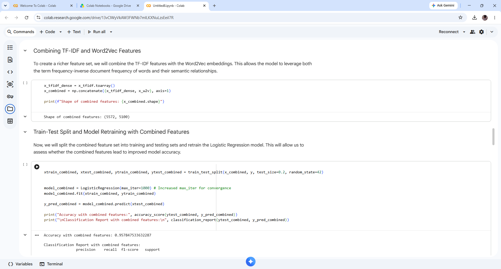
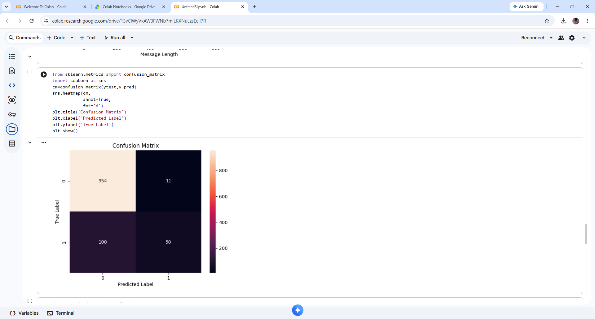
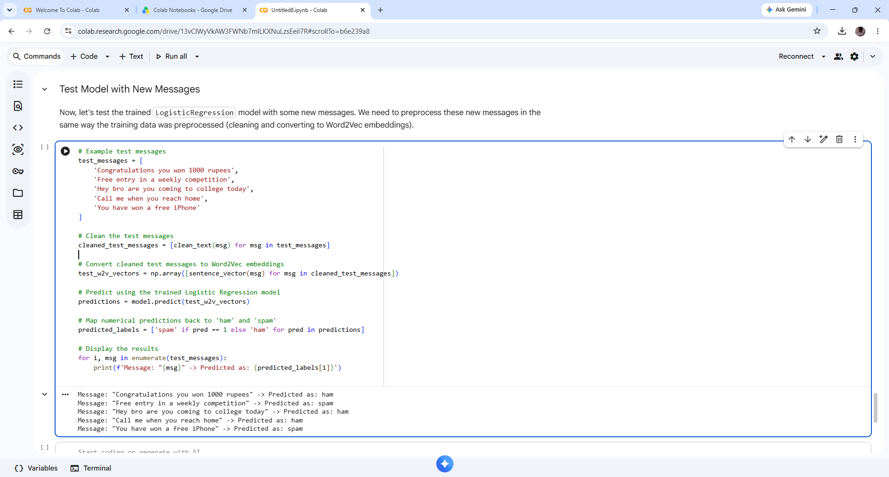
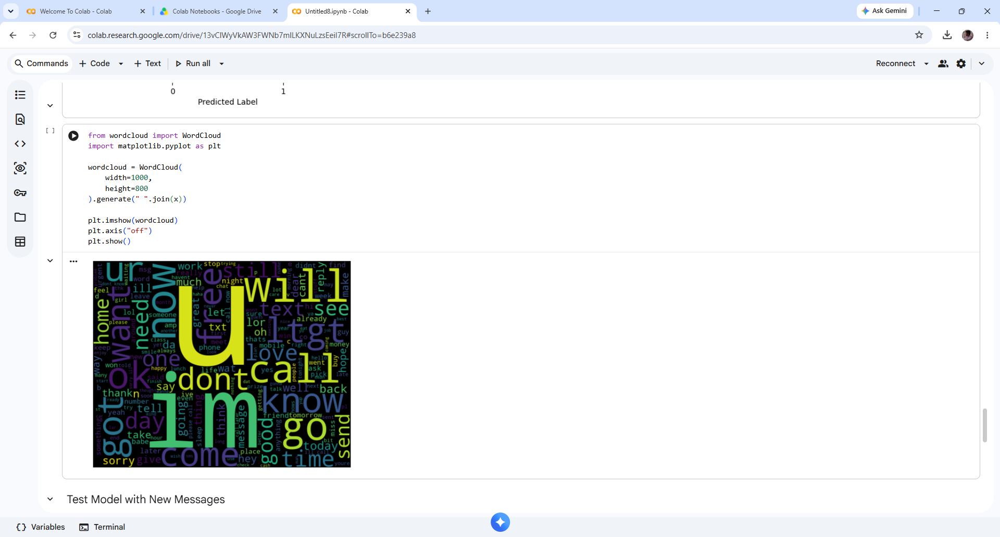
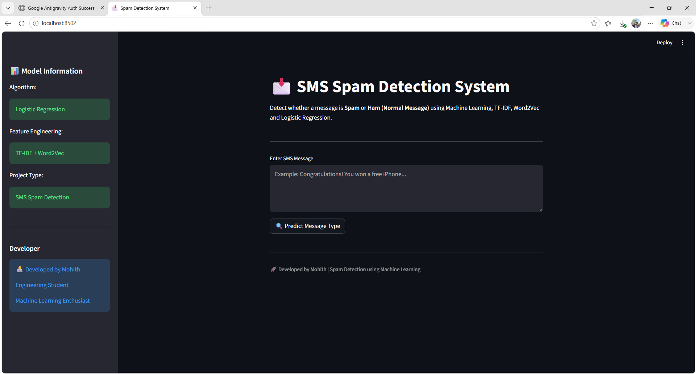
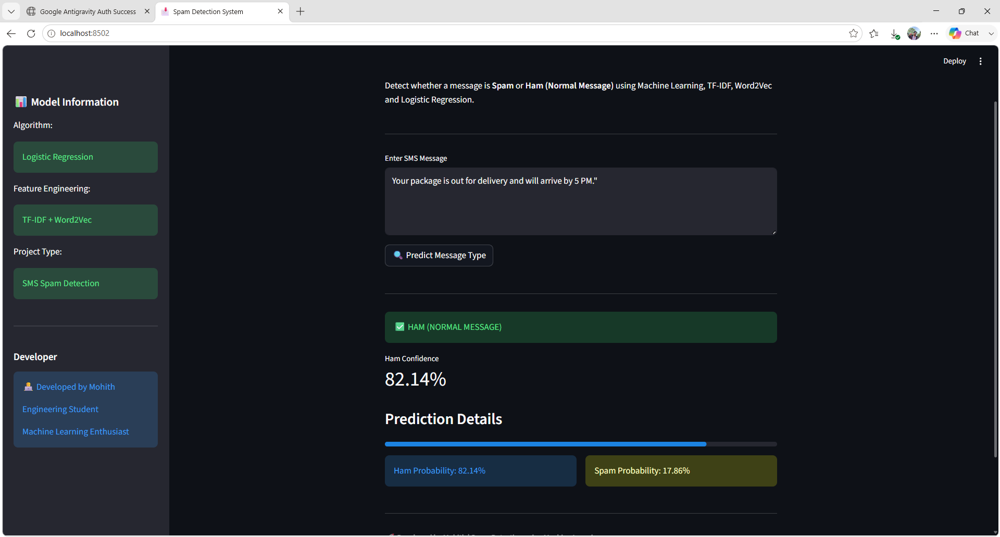
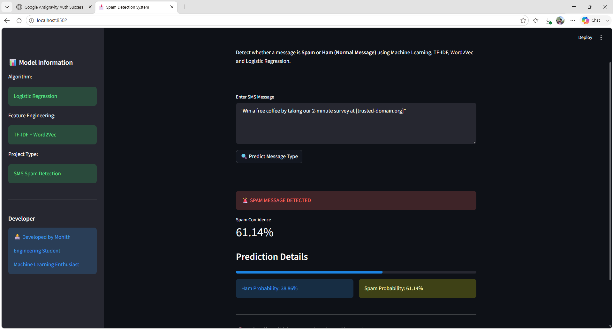
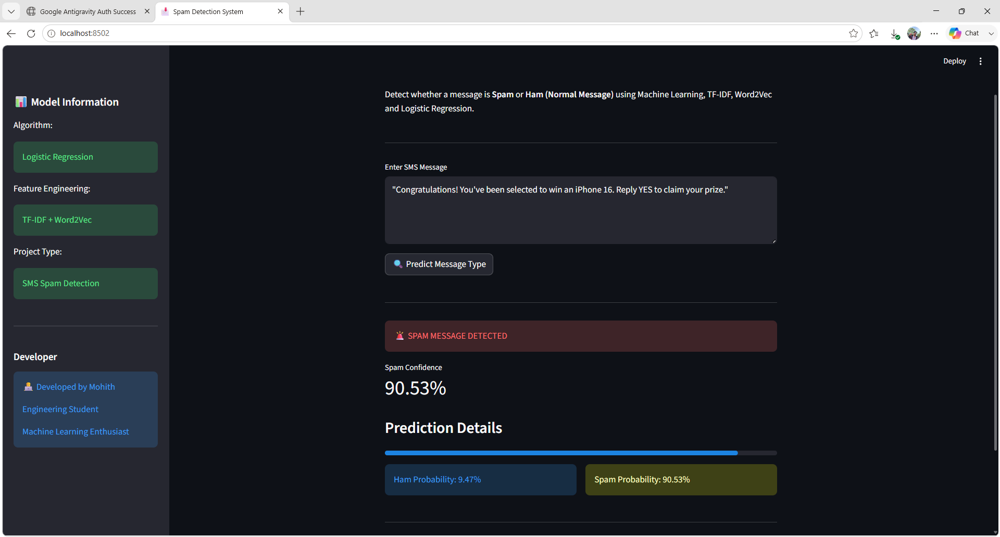

# SPAM_DETECTION

📩 SMS / E-Mail Spam Detection System

📌 Overview

The SMS Spam Detection System is a Machine Learning and Natural Language Processing (NLP) project that classifies SMS messages as Spam or Ham (Legitimate messages).

It uses advanced text preprocessing and feature engineering techniques such as TF-IDF and Word2Vec embeddings to improve classification performance.

---

🚀 Features

Detects Spam vs Ham messages in real time

Clean and structured text preprocessing pipeline

TF-IDF feature extraction

Word2Vec word embeddings for semantic understanding

Hybrid feature engineering (TF-IDF + Word2Vec)

Logistic Regression classification model 
### (Achived 95% accuracy) by using TF-IDF+WORD@VEC FOR TEXT PREPROCESSING

Interactive Streamlit web application

---

🛠️ Tech Stack

Python 🐍

Pandas, NumPy

Scikit-Learn

Gensim (Word2Vec)

Streamlit

Git & GitHub

---

📊 Machine Learning Workflow

1. Data Collection

2. Text Preprocessing

3. TF-IDF Feature Extraction

4. Word2Vec Embedding Generation

5. Feature Combination (TF-IDF + Word2Vec)

6. Model Training

7. Model Evaluation

8. Deployment using Streamlit

---

🧹 Text Preprocessing Steps

Lowercasing text

Removing special characters

Removing punctuation

Tokenization

Cleaning stopwords (if applied)

---

🔍 Feature Engineering

📌 TF-IDF (Term Frequency – Inverse Document Frequency)

Converts text into numerical form based on word importance in the corpus.

📌 Word2Vec

Captures semantic meaning of words by mapping them into dense vector representations.

📌 Hybrid Approach

Combines TF-IDF + Word2Vec to improve model understanding and accuracy.

---

🤖 Machine Learning Model

Logistic Regression Classifier

Why Logistic Regression?

Fast and efficient

Works well for binary classification

Performs strongly on text classification tasks

---

📈 Evaluation Metrics

Model performance is evaluated using:

Accuracy

Precision

Recall

F1 Score

Confusion Matrix

---

🌐 Streamlit Web App

The trained model is deployed using Streamlit, allowing users to input SMS messages and get instant predictions.

---

▶️ How to Run This Project

1️⃣ Clone the repository

git clone https://github.com/mohithbalakrishnan/SPAM_DETECTION.git
cd sms-spam-detection

---

2️⃣ Install dependencies

pip install -r requirements.txt

---

3️⃣ Run the application

streamlit run app.py

---

📦 Requirements (requirements.txt)

numpy
pandas
scikit-learn
gensim
streamlit
nltk

---

📸 Sample Output

Input:

> “Congratulations! You have won a free prize”

Output:

> 🚨 Spam Message

## 📸 Screenshots

### 🧠 Model Training Output
Shows the training process and model performance.)

---

### 🌐 Streamlit UI
User interface for real-time SMS spam prediction.

---

---

👨‍💻 Developer

Mohith
Machine Learning & AI Enthusiast

---

🔗 Connect With Me

GitHub: https://github.com/mohithbalakrishnan

LinkedIn: https://linkedin.com/in/mohith_b

